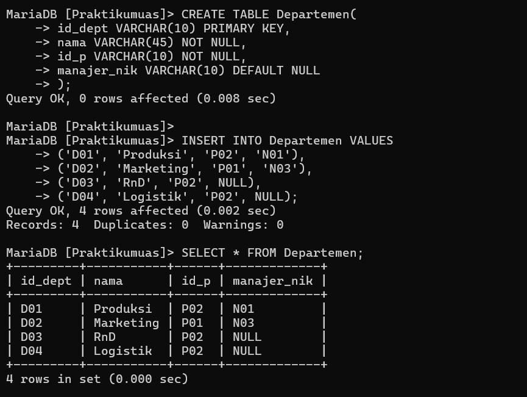
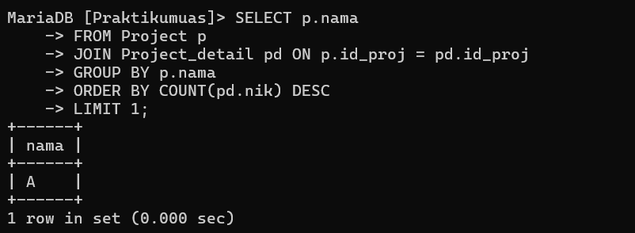

# UAS BASIS DATA 


## Profil
| Variable | Isi |
| -------- | --- |
| **Nama** | ALVIN ALFANDY |
| **NIM** | 312310473 |
| **Kelas** | TI.23.A5 |
| **Mata Kuliah** | Basis data |

***Query MySQL Pada Tabel Perusahaan***

```
CREATE TABLE Perusahaan(
id_p VARCHAR(10) PRIMARY KEY,
nama VARCHAR(45) NOT NULL,
alamat VARCHAR(45) DEFAULT NULL
);

INSERT INTO Perusahaan VALUES
('P01', 'Kantor Pusat', NULL),
('P02', 'Cabang Bekasi', NULL);
SELECT * FROM Perusahaan;
```

***Output :***


***Query MySQL Pada Tabel Departemen***

```
CREATE TABLE Departemen(
id_dept VARCHAR(10) PRIMARY KEY,
nama VARCHAR(45) NOT NULL,
id_p VARCHAR(10) NOT NULL,
manajer_nik VARCHAR(10) DEFAULT NULL
);

INSERT INTO Departemen VALUES
('D01', 'Produksi', 'P02', 'N01'),
('D02', 'Marketing', 'P01', 'N03'),
('D03', 'RnD', 'P02', NULL),
('D04', 'Logistik', 'P02', NULL);
SELECT * FROM Departemen;
```

***Output :***




***Query MySQL Pada Tabel Karyawan***

```
CREATE TABLE Karyawan(
    nik VARCHAR(10) PRIMARY KEY,
    nama VARCHAR(45) NOT NULL,
    id_dept VARCHAR(10) NOT NULL,
    sup_nik VARCHAR(10) DEFAULT NULL,
    gaji_pokok INT
);

INSERT INTO Karyawan VALUES
('N01', 'Ari', 'D01', NULL, 2000000),
('N02', 'Dina', 'D01', NULL, 2500000),
('N03', 'Rika', 'D03', NULL, 2400000),
('N04', 'Ratih', 'D01', 'N01', 3000000),
('N05', 'Riko', 'D01', 'N01', 2800000),
('N06', 'Dani', 'D02', NULL, 2100000),
('N07', 'Anis', 'D02', 'N06', 5000000),
('N08', 'Dika', 'D02', 'N06', 4000000),
('N09', 'Raka', 'D03', NULL, 2000000);

SELECT * FROM Karyawan;
```

***Output :***


***Query MySQL Pada Tabel Project***

```sql
CREATE TABLE Project(
id_proj VARCHAR(10) PRIMARY KEY,
nama VARCHAR(45) NOT NULL,
tgl_mulai DATETIME,
tgl_selesai DATETIME,
status TINYINT(1)
);

INSERT INTO Project VALUES
('PJ01', 'A', '2019-01-10', '2019-03-10', '1'),
('PJ02', 'B', '2019-02-15', '2019-04-10', '1'),
('PJ03', 'C', '2019-03-21', '2019-05-10', '1');
SELECT * FROM Project;
```

***Output :***


***Query MySQL Pada Tabel Project Deatil***

```sql
CREATE TABLE Project_detail(
id_proj VARCHAR(10) NOT NULL,
nik VARCHAR(10) NOT NULL
);

INSERT INTO Project_detail VALUES
('PJ01', 'N01'),
('PJ01', 'N02'),
('PJ01', 'N03'),
('PJ01', 'N04'),
('PJ01', 'N05'),
('PJ01', 'N07'),
('PJ01', 'N08'),
('PJ02', 'N01'),
('PJ02', 'N03'),
('PJ02', 'N05'),
('PJ03', 'N03'),
('PJ03', 'N07'),
('PJ03', 'N08');
SELECT * FROM Project_detail;
```

***Output :***


# Soal uas


### Berdasarkan ERD dan Sampel Data diatas buatla Query SQL untuk:
1. Menampilkan Nama Karyawan yang Berada di Departemen yang Dipimpin
oleh Manajer dengan Nama 'Rika'
2. Menampilkan Nama Proyek yang dikerjakan oleh Karyawan dari
Departemen 'RnD'
3. Menampilkan Nama Karyawan yang Terlibat dalam Lebih dari Satu Proyek
4. Menampilkan Nama Proyek yang melibatkan Karyawan terbanyak.
5. Menampilkan Nama Proyek yang Diikuti oleh Karyawan dengan Gaji Pokok
Kurang dari 3 Juta


## 1. Menampilkan Nama Karyawan yang Berada di Departemen yang Dipimpin oleh Manajer dengan Nama 'Rika'

***Input :***

```sql
SELECT k.nama 
FROM Karyawan k
JOIN Departemen d ON k.id_dept = d.id_dept
WHERE d.manajer_nik = (
    SELECT nik 
    FROM Karyawan 
    WHERE nama = 'Rika'
);
```
***Output :***


## 2.Menampilkan Nama Proyek yang dikerjakan oleh Karyawan dari Departemen 'RnD'
***input :***

```sql
SELECT DISTINCT p.nama 
FROM Project p
JOIN Project_detail pd ON p.id_proj = pd.id_proj
JOIN Karyawan k ON pd.nik = k.nik
WHERE k.id_dept = (
    SELECT id_dept 
    FROM Departemen 
    WHERE nama = 'RnD'
);
```

***Output :***


## 3. Menampilkan Nama Karyawan yang Terlibat dalam Lebih dari Satu Proyek 

***Input :***

```sql
SELECT k.nama 
FROM Karyawan k
JOIN Project_detail pd ON k.nik = pd.nik
GROUP BY k.nama
HAVING COUNT(pd.id_proj) > 1;
```

***Output :***


## 4.Menampilkan Nama Proyek yang melibatkan Karyawan terbanyak.
***Input :***

```SQL
SELECT p.nama 
FROM Project p
JOIN Project_detail pd ON p.id_proj = pd.id_proj
GROUP BY p.nama
ORDER BY COUNT(pd.nik) DESC
LIMIT 1;
```

***Output :***



## 5. Menampilkan Nama Proyek yang Diikuti oleh Karyawan dengan Gaji Pokok Kurang dari 3 Juta

***Input :***

```sql
SELECT DISTINCT p.nama 
FROM Project p
JOIN Project_detail pd ON p.id_proj = pd.id_proj
JOIN Karyawan k ON pd.nik = k.nik
WHERE k.gaji_pokok < 3000000;
```

***Output :***


